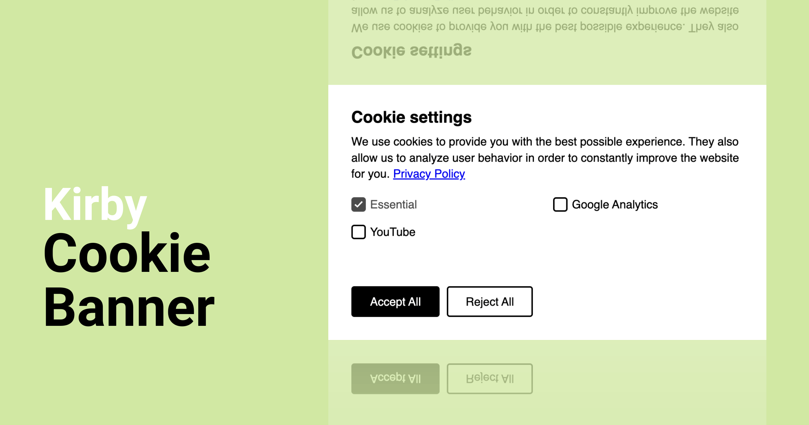

# Kirby Cookie Banner

Integrate a user-friendly cookie banner into your Kirby website with ease. This simple solution allows for effortless
incorporation directly into your Kirby page.

## Key Features

* 🚀 **Customizable Cookie Consent Modal:** Design the modal to perfectly match your website's look and feel.
* 🌐 **Multilingual Support (including German & English):** Deliver a seamless user experience by displaying the cookie
  banner in different languages.
* ⏱️ **Real-time Cookie Consent Detection:** Keep track of user preferences and adapt accordingly.
* ✅ **Easy Feature Management with a Helper Class:** Simplify checking for allowed cookies and features within your
  Kirby
  code.
* ✨ **Effortless Style Integration:** Apply your custom CSS styles with minimal hassle.

## Installation

### Composer

```
composer require michnhokn/kirby3-cookie-banner
```

### Download

Download and copy this repository to `/site/plugins/kirby-cookie-banner`

## Usage

### Configuration

The cookie banner includes a pre-configured "Essential Feature" with customizable text using language variables. You can
easily add more features by editing your `/site/config/config.php` file. By default, leverage language variables for
feature values, but if you're not using Kirby's multi-language functionality, simply adjust the text directly in the
configuration.

```php
<?php
// site/config/config.php

return [
    'michnhokn.cookie-banner' => [
        // add your features and the language variables
        'features' => [
            'analytics' => 'custom.cookie-modal.analytics',
            'mapbox' => 'custom.cookie-modal.mapbox',
            ...
        ]
        // optional - adjust the texts if you are not using Kirby's multi-language functionality
        'translations' => [
            'title' => 'Your custom title',
            'text' => 'This is your custom Text',
            'essentialText' => 'Essenziell',
            'denyAll' => 'Alle ablehnen',
            'acceptAll' => 'Alle annehmen',
            'save' => 'Speichern',
        ]
    ]
];
```

### Snippet

```` php
<?php snippet('cookie-modal', [
    // Loads the custom assets of the plugin. Default: true
    'assets' => false,
    // Displays the consent modal on initial load. Default: true
    'showOnFirst' => false,
    // [WIP] Reloads the whole page instead of loading only the blocked scripts. Default: true
    // 'reload' => false,
    // [WIP] Can be used to set a new consent version to force a new display for the end user. Default: null
    // 'version' => 1,
    // Adds additional features. I recommend using the config. Default: null
    'features' => [
        'analytics' => 'custom.cookie-modal.analytics',
        'mapbox' => 'custom.cookie-modal.mapbox',
        ...
    ]
]) ?>
````

### Track User Cookie Preferences

The cookie banner triggers a cookies:saved event on the <body> tag whenever a user confirms their settings. This allows
you to easily capture this event and react accordingly. Here's an example of how you might intercept it:

```javascript
document.querySelector('body').addEventListener('cookies:saved', ({detail}) => {
  console.log('Saved cookie features:', detail);
})

// Example output (array)
// Saved cookie features: ['essential', 'analytics', 'mapbox']
```

### Open the cookie modal

Want to give users the option to revisit cookie settings? Simply add a link that calls the openCookieModal() method of
the cookie banner. For instance, clicking this link would reopen the modal:

```html
<a href="javascript:cookieBanner.openCookieModal()">Edit Cookie Settings</a>
```

### Helper class

The `Michnhokn\CookieBanner` class offers a set of handy methods to control your cookie features.

This simplifies tasks like:

* Checking if a specific feature is allowed by the user.
* Performing actions based on allowed features.

```php
// returns a list of features accepted by the visitor
\Michnhokn\CookieBanner::allowedFeatures(): array

// check if one feature is accepted by the visitor
\Michnhokn\CookieBanner::isFeatureAllowed('youtube'): bool

// returns all configured plus additional features
\Michnhokn\CookieBanner::availableFeatures(additionalFeatures: ['recaptcha']): array

// clear the cookie for a visitor
\Michnhokn\CookieBanner::clear(): void
```

### Translate the modal

Customize your cookie banner for a global audience! Simply provide the following variables through a language file to
translate the modal content. This ensures a seamless user experience in any language.

```php
// site/languages/es.php
<?php

return [
  'code' => 'es',
  'default' => true,
  'direction' => 'ltr',
  'locale' => 'es_ES',
  'name' => 'Spanish',
  'translations' => [
    'michnhokn.cookie-banner.title' => 'Configuración de las galletas',
    'michnhokn.cookie-banner.text' => 'Utilizamos cookies para proporcionarle la mejor experiencia posible. También nos permiten analizar el comportamiento de los usuarios para mejorar constantemente el sitio web para usted.  (link: politica-de-privacidadtext: Política de privacidad)',
    'michnhokn.cookie-banner.essentialText' => 'Esencial',
    'michnhokn.cookie-banner.denyAll' => 'Rechazar todo',
    'michnhokn.cookie-banner.acceptAll' => 'Acepta todo',
    'michnhokn.cookie-banner.save' => 'Guardar la configuración',

    // custom features translation
    'custom.cookie-modal.analytics' => 'Analítica'
  ]
];
```

## Support the project

> [!NOTE]
> This plugin is provided free of charge & published under the permissive MIT License. If you use it in a commercial
> project, please consider to [buy me a beer 🍺](https://buymeacoff.ee/michnhokn)

## License

[MIT](./LICENSE) License © 2020-PRESENT [Michael Engel](https://github.com/michnhokn)
